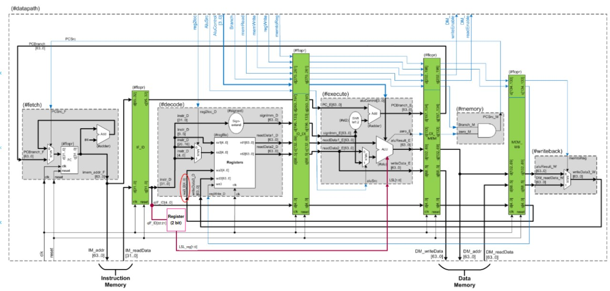

# Laboratorio 1 - Mejora de procesador con pipeline
Dado el procesador que venimos desarrollando en clase, se piden distintas mejoras y modificaciones para lograr un procesador con más instrucciones y que sea más eficiente. Las consignas propuestas y resueltas por el grupo son las siguientes:

## Ejercicio 1
Con el objetivo de agregar funcionalidad al procesador, se pide agregar la instrucción `MOVZ` que permite mover un inmediato de 16 bits a un registro colocando los otros 48 bits en 0.

### Ejecución
Lo primero realizado fue adaptar el procesador utilizando los módulos que proveía la cátedra, realizando algunas modificaciones para lograr obtener el funcionamiento y los resultados de memoria esperados.
Las modificaciones fueron varias. La que realizamos en principio fueron las propuestas por la cátedra en las "modificaciones recomendadas", luego vimos necesario agregar un bit al bus de direccionamiento en imem para ahora poder almacenar hasta 128 instrucciones en la memoria ROM. Además, utilizamos para generar el código inicial, el script también proveido por la cátedra, al cual se le pasó el archivo main.s que previamente editamos para que contenga los NOP(ADD XZR, XZR, XZR) necesarios para que el procesador funcione correctamente y evite hazards tanto de datos como de control.

Una vez el procesador quedó en funcionamiento, restaba agregar la nueva instrucción `MOVZ`. Para esto, por un lado se agregó un registro de 2 bits binarios para almacenar el LSL que se le debe aplicar al inmediato de 16 bits. Se debe almacenar dado que si no vamos a utilizar el LSL de la instrucción n+1 para el inmediato de la instrucción n.
Por otro lado, se configuraron las señales en el maindec para que en la instrucción `MOVZ`, se use el signext para extender el inmediato de 16 bits a 64 bits, y luego enviar el resultado a la ALU.
El LSL se conecta al módulo de execute, puntualmente a la ALU, donde se realiza el calculo del MOVZ. Para esto, se agregó un nuevo case en el módulo de la ALU, donde el alucontrol es 4'b0100. En este caso, se realiza un shift left lógico del inmediato de 16 bits, tantas veces como el LSL indique.
Finalmente, el resultado de la ALU continua su camino por el procesador normalmente, para poder escribirlo en el registro correspondiente. Para esto, no fue necesario agregar nada nuevo, simplemente setear las señales correspondientes en el maindec.

Las señales en maindec fueron configuradas:
- `Reg2Loc` = 0
- `ALUSrc` = 1
- `MemtoReg` = 0
- `RegWrite` = 1
- `MemRead` = 0
- `MemWrite` = 0
- `Branch` = 0
- `ALUOp` = 2'b11

Luego en el módulo de aludec, a partir del `ALUOp` se setean las señales correspondientes para que la ALU realice el shift left lógico. Puntualmente:
- `ALUControl` = 4'b0100

Finalmente, en el módulo de la ALU, se agrega un nuevo case para el `ALUControl` 4'b0100, donde se realiza el shift left lógico del inmediato. Tal que:
- `4'b0100: result = b << (LSL * 16);`

### Resultados
Para probar el funcionamiento de la instrucción `MOVZ`, se agregó al archivo main.s las siguientes instrucciones para probar cada uno de los distintos lsl posibles del inmediato:
```
MOVZ X26, 0xDEAD, LSL 0
MOVZ X27, 0x7ECA, LSL 16
MOVZ X28, 0xC0CA, LSL 32
MOVZ X29, 0xFEED, LSL 48
```

El resultado de la ejecución de estas instrucciones produce el siguiente resultado en memoria:
```
000000000000DEAD
000000007ECA0000
0000C0CA00000000
FEED000000000000
```

El resultado de agregar la instrucción `MOVZ` fue el esperado. El procesador continua funcionando correctamente y los cambios realizados en cuanto a las señales y el registro de LSL pueden verse en la siguiente imagen:


